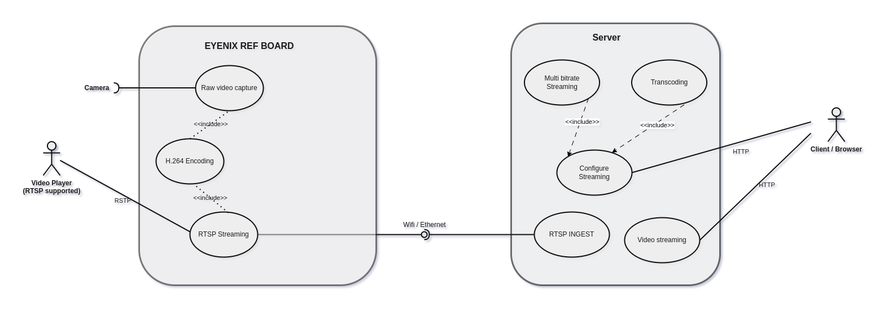

# Temporary document

## Reverse proxy

[Nginx comparison](https://www.nginx.com/products/nginx/compare-models/)

## WHY REVERSE PROXY
	+ Load balancing
	+ Adaptive bitrate
	+ protection from attacks
	+ caching
	+ logging
	
### RTSP AND HLS

RTSP and HLS

 
 
### RTMP VS RTSP

+ RTMP comes with a larger delay for your viewers while offering more support for different codecs. It also provides better low-latency streaming and a more stable connection. However, it doesn’t work with HTML5 and HTTP, leading to accessibility issues.
 
 
+ RTSP offers a much shorter delay but, in turn, supports fewer codecs. It also doesn’t have the same stability that RTMP offers, sacrificing stability for customization.

 
 
### VOD & LIVE 
Live Streaming vs. VOD. While live streaming and VOD are both methods of online video delivery, you cannot have live to VOD streaming without first recording live content. VOD is, at its core, a method for viewing pre-recorded video content.
 
 

[A Comprehensive Overview of RTSP vs RTMP](https://www.gumlet.com/learn/rtsp-vs-rtmp/)

### PROXY SERVER COMPARISON

 
 
[Forward vs. Reverse Proxy: Benefits & Use Cases in 2023](https://research.aimultiple.com/forward-vs-reverse-proxy)

### LIVE STREAMING VIA HLS
As per HLS specs,segment duration must be 6 sec. But to achieve low latency we usually keep 2sec as segment duration specially in live tv stream.
 
 
[What is HTTP Live Streaming? | HLS streaming](cloudflare.com/learning/video/what-is-http-live-streaming/)
### LIVE STREAMING 
LATENCY CHART

COMPARISON AMONG STREAMING PROTOCOLS

STREAMING PROTOCOLS LATENCY SPECTRUM

### RTMP EXPLAINED

[What is RTMP Streaming- Everything you need to know in 2022](https://www.dreamcast.in/blog/rtmp-streaming/)

### ADAPTIVE BITRATE STREAMING

#### What is HTTP dynamic streaming (HDS)?
+ HTTP dynamic streaming, or HDS, is an adaptive bitrate streaming method developed by Adobe
+ HDS can be used for on-demand streaming or live streaming
+ HDS is not supported by Apple devices.
[More..](https://www.cloudflare.com/learning/video/what-is-http-dynamic-streaming/)

### Advantages of HLS
+ Adaptive bitrate
+ Widely supported platforms
+ Best Quality video 

### Disadvantages of HLS
+ \> Latency ( 3-20 sec ) 
 
 
[more..](https://medium.com/av-transcode/hls-streaming-protocol-pros-and-cons-of-choosing-it-12ef080163b0uc )

 
 
[What is Adaptive bitrate streaming](https://www.cloudflare.com/learning/video/what-is-adaptive-bitrate-streaming/)

[Adaptive Bitrate Vs Multi-bitrart Streaming](https://www.muvi.com/blogs/adaptive-bitrate-vs-multi-bitrate-streaming)

[6 Preffered Format for Proffessional Broadcasting](https://www.dacast.com/blog/video-streaming-protocol/)

### VARIOUS WAYS TO STREAM
[7-ways-to-stream-rtsp-on-the-page](https://flashphoner.com/7-ways-to-stream-rtsp-on-the-page/)

[Playback of RTSP video streams in browsers and mobile applications with the use of WebRTC and Websocket](https://flashphoner.com/ip-camera-streaming-via-rtsp-for-webrtc-and-websocket-browsers/)

Display method 	| Best for 	| Latency |
-----------------|-----------|---------|
RTMP 	| Legacy Flash, Flex or Adobe Air applications 	| medium
RTMP + HTML5 	| IE, Edge, Mac Safari browsers if Flash Player is installed 	| medium
RTMFP 	| Legacy Flash, Flex or Adobe Air applications that require low latency 	| low
RTMFP + HTML5 | 	IE, Edge, Mac Safari browsers if Flash Player is installed and when low latency is crucial 	| low
WebRTC 	| Chrome, Firefox, Opera browsers on mobile devices and desktops on Android and when real-time playback is crucial. 	| real-time
Websocket 	| Browsers that lack support for Flash and WebRTC, but the task requires low to medium latency. 	| medium
HLS 	| Any browser as long as latency is not important. 	| high
Android app, WebRTC |  	Native mobile applications for Android that require real-time latency. 	| real-time
iOS app, WebRTC 	| Native mobile applications for iOS that require real-time latency. 	| real-time

### WEBRTC

[WebRTC Video Streaming: A Full Guide to Interactive Streaming](https://riverside.fm/blog/webrtc-video-streaming)

WebRTC is a free and open-source project providing web browsers and mobile applications with real-time communication via application programming

TURN ( Traversal Using Relays Around NAT )
STUN ( Session Traversal Utilities for NAT )
<!--  -->

[Browser-based WebRTC stream from RTSP IP camera with low latency](https://flashphoner.com/browser-based-webrtc-stream-from-rtsp-ip-camera-with-low-latency/)

 
 

 
 

## TRANSCODING

 
 
 
 
 
 
 
 
