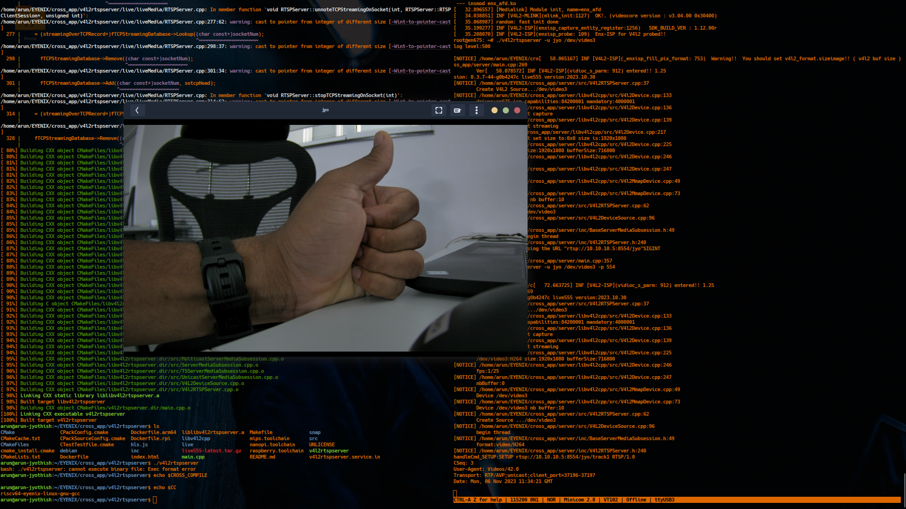

# EYENIX EVK10 BOARD STREAMING SETUP

Eyenix EN675 SoC Based Evaluation Kit (EVK10) Streaming Setup Procedure( EN675 M/X )

## EVK10 HW SPECIFICATIONS ##

- EN675M SoC used   
- 1GB DDR3 1.5V RAM 
- NOR Flash 32 MB   

</strong>

## BOARD CONNECTION SETUP

Board provides two **UART** comms. The one with designated **'AP UART'** in the EVK10 Board is used as main Console for Linux.   another **'ISP UART'** is 'Image Signal Processing Console' Specifically used for configure and debug Eyenix Baremetal Videocore firmware

## [__GET EYENIX EN675 SDK__](https://dicortech-my.sharepoint.com/:u:/p/arun_jyothish/EWQ_gvybFWJIov1t-LSNhGABeI9X4nSoxj8VQiXQxJpldw?e=1rnHvI)
## CROSSCOMPILER SETUP

Tools Available after Installation  at
  **/opt/riscv/eyenix/bin/**
~~~
riscv64-eyenix-elf-addr2line            riscv64-eyenix-linux-gnu-addr2line
riscv64-eyenix-elf-ar                   riscv64-eyenix-linux-gnu-ar
riscv64-eyenix-elf-as                   riscv64-eyenix-linux-gnu-as
riscv64-eyenix-elf-c++                  riscv64-eyenix-linux-gnu-c++
riscv64-eyenix-elf-c++filt              riscv64-eyenix-linux-gnu-c++filt
riscv64-eyenix-elf-cpp                  riscv64-eyenix-linux-gnu-cpp
riscv64-eyenix-elf-elfedit              riscv64-eyenix-linux-gnu-elfedit
riscv64-eyenix-elf-g++                  riscv64-eyenix-linux-gnu-g++
riscv64-eyenix-elf-gcc                  riscv64-eyenix-linux-gnu-gcc
riscv64-eyenix-elf-gcc-10.1.0           riscv64-eyenix-linux-gnu-gcc-10.1.0
riscv64-eyenix-elf-gcc-ar               riscv64-eyenix-linux-gnu-gcc-ar
riscv64-eyenix-elf-gcc-nm               riscv64-eyenix-linux-gnu-gcc-nm
riscv64-eyenix-elf-gcc-ranlib           riscv64-eyenix-linux-gnu-gcc-ranlib
riscv64-eyenix-elf-gcov                 riscv64-eyenix-linux-gnu-gcov
riscv64-eyenix-elf-gcov-dump            riscv64-eyenix-linux-gnu-gcov-dump
riscv64-eyenix-elf-gcov-tool            riscv64-eyenix-linux-gnu-gcov-tool
riscv64-eyenix-elf-gdb                  riscv64-eyenix-linux-gnu-gdb
riscv64-eyenix-elf-gdb-add-index        riscv64-eyenix-linux-gnu-gdb-add-index
riscv64-eyenix-elf-gprof                riscv64-eyenix-linux-gnu-gprof
riscv64-eyenix-elf-ld                   riscv64-eyenix-linux-gnu-ld
riscv64-eyenix-elf-ld.bfd               riscv64-eyenix-linux-gnu-ld.bfd
riscv64-eyenix-elf-lto-dump             riscv64-eyenix-linux-gnu-lto-dump
riscv64-eyenix-elf-nm                   riscv64-eyenix-linux-gnu-nm
riscv64-eyenix-elf-objcopy              riscv64-eyenix-linux-gnu-objcopy
riscv64-eyenix-elf-objdump              riscv64-eyenix-linux-gnu-objdump
riscv64-eyenix-elf-ranlib               riscv64-eyenix-linux-gnu-ranlib
riscv64-eyenix-elf-readelf              riscv64-eyenix-linux-gnu-readelf
riscv64-eyenix-elf-run                  riscv64-eyenix-linux-gnu-run
riscv64-eyenix-elf-size                 riscv64-eyenix-linux-gnu-size
riscv64-eyenix-elf-strings              riscv64-eyenix-linux-gnu-strings
riscv64-eyenix-elf-strip                riscv64-eyenix-linux-gnu-strip

~~~

## BSP BUILD SETUP
Board Support Package Build setup for Eyenix EN675M Soc with NOR Flash memory

~~~zsh

arun@arun-jyothish:~/EYENIX/en675_linux_sdk_en675M/bsp_release/en675_linux_bsp_en675M$ grade=m source Cross.param 

------ cross parameters are configured for EN675(M), SINGLE, , NOR (Image: gzip)
arun@arun-jyothish:~/EYENIX/en675_linux_sdk_en675M/bsp_release/en675_linux_bsp_en675M$ make print-path
-e 	 chipset 	:  EN675M
-e 	 sdk_root 	:  /home/arun/EYENIX/en675_linux_sdk_en675M/bsp_release/en675_linux_bsp_en675M
-e 	 ARCH 		:  riscv ( riscv64-eyenix-linux-gnu- )
-e 	 BOARD TYPE 	:  EVK10
-e 	 CFLAGS 	:  -mabi=lp64d -march=rv64imafdc -D_EN675_SINGLE_ -g 
-e 	 FLASH TYPE 	:  NOR
-e 	 COMPRESSION 	:  gzip
-e 	 is_ai_analog 	:  

arun@arun-jyothish:~/EYENIX/en675_linux_sdk_en675M/bsp_release/en675_linux_bsp_en675M$ 

~~~

Eyenix Necessary Configuration file **(BSP)/conf/en675M/board_M.cfg  **
Sample Network Configurations Snippet
~~~
# Ethernet
# UBOOT_TFTP="dhcp"                   # 'tftp' : static default LOCAL_IP,
                                    # 'dhcp' : ipaddr by dhcp client. (default)
NETMASK="255.255.255.0"
GATEWAY_IP="10.10.10.1"
LOCAL_IP="10.10.10.5"
TFTP_SERVER_IP="10.10.10.2"
DEF_MAC_ADDR="00:15:4c:01:00:50"    # default mac-address. ( if flash has mac_address, this should be blocked. )
HOST_NAME="eyenix_$CHIPSET"
NET_AUTO="off"                      # This is not valid changing to 'on' currently.
DHCP_ONOFF="on"                     # rootfs, ethernet dhcpc  'on / off'

~~~
## BUILD FILES
~~~
make build all

ls (bsp)/build

app.ubifs  kernel.en675.gz  u-boot.en675.bin  videocore.gz

~~~

- **Possible build issue during kernel build**
~~~
  CC      arch/riscv/kernel/asm-offsets.s
  HOSTLD  scripts/dtc/dtc
/usr/bin/ld: scripts/dtc/dtc-parser.tab.o:(.bss+0x10): multiple definition of `yylloc'; scripts/dtc/dtc-lexer.lex.o:(.bss+0x0): first defined here
collect2: error: ld returned 1 exit status
make[3]: *** [scripts/Makefile.host:99: scripts/dtc/dtc] Error 1
make[2]: *** [/home/arun/EYENIX/en675_linux_sdk_en675M/bsp_release/en675_linux_bsp_en675M/linux/Makefile:1248: scripts_dtc] Error 2
make[2]: *** Waiting for unfinished jobs....
  UPD     include/generated/asm-offsets.h
  CALL    /home/arun/EYENIX/en675_linux_sdk_en675M/bsp_release/en675_linux_bsp_en675M/linux/scripts/checksyscalls.sh
make[2]: Leaving directory '/home/arun/EYENIX/en675_linux_sdk_en675M/bsp_release/en675_linux_bsp_en675M/work/linux'
make[1]: *** [Makefile:152: sub-make] Error 2
make[1]: Leaving directory '/home/arun/EYENIX/en675_linux_sdk_en675M/bsp_release/en675_linux_bsp_en675M/linux'
make: *** [Makefile:53: /home/arun/EYENIX/en675_linux_sdk_en675M/bsp_release/en675_linux_bsp_en675M/work/linux/vmlinux] Error 2
~~~
solution:

***(BSP)/work/linux/scripts/dtc/dtc-parser.tab.c***
~~~c
1179 
1180 
1181 /* Lookahead token kind.  */
1182 int yychar;
1183 
1184 /* The semantic value of the lookahead symbol.  */
1185 YYSTYPE yylval;
1186 /* Location data for the lookahead symbol.  */
1187 YYLTYPE yylloc
1188 # if defined YYLTYPE_IS_TRIVIAL && YYLTYPE_IS_TRIVIAL
1189   = { 1, 1, 1, 1 }
1190 # endif
1191 ;
1192 /* Number of syntax errors so far.  */
1193 int yynerrs;
1194 
1195 
1196 
1197 
1198 /*----------.
1199 | yyparse.  |
1200 `----------*/
1201 
1202 int
1203 yyparse (void)
1204 {
1205     yy_state_fast_t yystate = 0;
1206     /* Number of tokens to shift before error messages enabled.  */

~~~~
Change Line number 1187 

~~~~c
1187 extern YYLTYPE yylloc
1188 # if defined YYLTYPE_IS_TRIVIAL && YYLTYPE_IS_TRIVIAL
1189   = { 1, 1, 1, 1 }
1190 # endif
1191 ;
~~~~

---------------

## FLASHING IMAGES 
Uboot raw Binary image flash into NOR Flash memory withing Evaluation Board (EVK10)

|u-boot.en675.bin |kernel.en675.gz | videocore.en675.gz |app.img|
|-----|------|----|----|
|0x00| 0x80000 | 0x880000| 0x990000 |

**Flashing tool ECMT ( Eyenix Control Management Tool )**

## STARTUP SCRIPT

 

#### SETUP SCRIPT
~~~zsh
#! /bin/sh

cd /App/drv/
sh insert.sh
cd

ifconfig eth0 10.10.10.5 netmask 255.255.255.0 up
mkdir -p nfs
mount -t nfs -o nolock 10.10.10.2:/nfs_eyenix nfs
cp /App/v4l2-ctl ~/
cp /App/v4l2rtspserver ~/

insmod /App/drv/enx-media.ko
	
~~~

## BOOTING AND SETUP UBOOT 

### HARDWARE SETUP
EVK10 Reference board has NOR flash on board with QSPI interface.	Inorder to Boot from On Board NOR Flash, **SW1** on Eyenix en675M SoM is used.

~~~
TP[3:0] = 0000b			// set to NOR boot 
TP[3:0] = 1101b			// set to NAND boot 
~~~

***J5 jumper on en675 carrier board used to select Onboard flash chip or External Flash chip***

~~~zsh
U-Boot 2020.10 + EN675-Release + (Oct 27 2023 - 17:15:36 +0530)

DDR3(1024MB) CLK: 796500000Hz (AXI CLK 398250000Hz), delay: 0x0
Model: eyenix,en675
DRAM:  1 GiB
MMC:   sdio@40600000: 0
Loading Environment from SPIFlash... SF: Detected mx25l25635e with page size 256 Bytes, erase size 64 KiB, total 32 MiB
OK
In:    serial
Out:   serial
Err:   serial
Model: eyenix,en675
SF: Detected mx25l25635e with page size 256 Bytes, erase size 64 KiB, total 32 MiB
device 0 offset 0x980000, size 0x10000
SF: 65536 bytes @ 0x980000 Read: OK

 => eth MAC : FF:FF:FF:FF:FF:FF

(flash mac 'ff:ff:ff:ff:ff:ff' is multicast!! environment ethaddr will be applied ...)
Net:   eth0: eth@40800000
Hit any key to stop autoboot:  0
EN675 #

~~~
#### ENVIRONMENTATL VARIABLES

~~~bash
EN675 # pri

arch=riscv
baudrate=115200
board=en675-ref
board_name=en675-ref
board_start=start_isp;start_kernel
bootcmd=run board_start
bootdelay=1
cpu=en675
ddr_build_time=15:51:54
ddr_date=20230313
ethact=eth@40800000
ethaddr=00:15:4c:01:00:50
fdtcontroladdr=8404dc20
gatewayip=192.168.0.1
ipaddr=10.10.10.5
isp_cp=sf probe 0;sf read 0x85000000 0x880000 0x100000
kernel_cp=sf probe 0;sf read 0x85000000 0x80000 0x800000
kernel_start=start_kernel
netmask=255.255.0.0
ramdisk_cp=sf probe 0;sf read 0x82000000 0x880000 0x0
serverip=10.10.10.2
soc=en675
stderr=serial
stdin=serial
stdout=serial
tba=mw.b 0x85000000 ff 0x1670000 && $tftp_mode 0x85000000 app.img && sf erase 0x990000 0x1670000 && sf update 0x85000000 0x990000 ${filesize} 
tbb=mw.b 0x85000000 ff 0x80000 && $tftp_mode 0x85000000 u-boot.en675.bin && sf update 0x85000000 0 0x80000 
tbi=mw.b 0x85000000 ff 0x100000 && $tftp_mode 0x85000000 videocore.gz && sf update 0x85000000 0x880000 0x100000 
tbk=mw.b 0x85000000 ff 0x800000 && $tftp_mode 0x85000000 kernel.en675.gz && sf update 0x85000000 0x80000 0x800000 
tbr=mw.b 0x85000000 ff 0x0 && $tftp_mode 0x85000000 ramdisk.en675.gz && sf update 0x85000000 0x880000 0x0 
tftp_mode=tftp
tftptimeout=2500
tftptimeoutcountmax=20
vendor=eyenix
ver=U-Boot 2020.10 + EN675-Release + (Oct 27 2023 - 17:15:36 +0530)

Environment size: 1304/65532 bytes

~~~ 

	- TFTP Setup
		Export Environment Variables

**Network can be configured with the following command**
~~~bash
setenv ipaddr 10.10.10.5
setenv serverip 10.10.10.2
~~~
Above step is optional if Everything specified in board config file in BSP **( (BSP)/conf/en675M/board_M.cfg 
)**  before buiding uboot as follows
~~~ 
 26 # Ethernet
 27 # UBOOT_TFTP="dhcp"                   # 'tftp' : static default LOCAL_IP,
 28                                     # 'dhcp' : ipaddr by dhcp client. (default)
 29 NETMASK="255.255.255.0"
 30 GATEWAY_IP="10.10.10.1"
 31 LOCAL_IP="10.10.10.5"
 32 TFTP_SERVER_IP="10.10.10.2"
 33 DEF_MAC_ADDR="00:15:4c:01:00:50"    # default mac-address. ( if flash has mac_address, this should be blocked. )
 34 HOST_NAME="eyenix_$CHIPSET"
 35 NET_AUTO="off"                      # This is not valid changing to 'on' currently.
 36 DHCP_ONOFF="on"                     # rootfs, ethernet dhcpc  'on / off'
 37
 38 # MTD Partition

~~~ 

## UPDATE IMAGES USING TFTP 
Depends  on **serverip** , **ipaddr** , **netmask** Environment Variable
~~~
N675 # pri ipaddr serverip netmask
ipaddr=10.10.10.5
serverip=10.10.10.2
netmask=255.255.0.0

EN675 # 
~~~

The following commands are used to update any images from Uboot console 
~~~bash

 18 tba=mw.b 0x85000000 ff 0x1670000 && $tftp_mode 0x85000000 app.img && sf erase 0x990000 0x1670000 && sf update 0x85000000 0x990000 ${filesize}
 17 tbb=mw.b 0x85000000 ff 0x80000 && $tftp_mode 0x85000000 u-boot.en675.bin && sf update 0x85000000 0 0x80000
 16 tbi=mw.b 0x85000000 ff 0x100000 && $tftp_mode 0x85000000 videocore.gz && sf update 0x85000000 0x880000 0x100000
 15 tbk=mw.b 0x85000000 ff 0x800000 && $tftp_mode 0x85000000 kernel.en675.gz && sf update 0x85000000 0x80000 0x800000
 14 tbr=mw.b 0x85000000 ff 0x0 && $tftp_mode 0x85000000 ramdisk.en675.gz && sf update 0x85000000 0x880000 0x0
~~~
example exec:
~~~
	run tba				# This will update the 'app.img' in NOR flash
~~~

example exec:
~~~
	run tbb				# This will update the 'uboot.img' in NOR flash
~~~
~~~zsh
EN675 # run tbb

link(1) speed(100) duplex(1)
Using eth@40800000 device
TFTP from server 10.10.10.2; our IP address is 10.10.10.5
Filename 'u-boot.en675.bin'.
Load address: 0x85000000
Loading: OK, send reply to the target 10:7d:1a:34:3e:3c
#############################
         4.1 MiB/s
done
Bytes transferred = 420744 (66b88 hex)
device 0 offset 0x0, size 0x80000
458752 bytes written, 65536 bytes skipped in 2.650s, speed 202516 B/s

EN675 # 

~~~

Check if **<mark>tftp_mode</mark>** _env_ set to **<mark>tftpboot</mark>** otherwise command won't work

	- Uboot Configuration Optional 
	- Network Setup
		- IP Address 
		- Netmask 
		- Gateway 

## EYENIX BOOT LOG 

__Username : root__ 
__Password : eyenix__ 

~~~
EN675 # run bootcmd
~~~
~~~

SF: Detected mx25l25635e with page size 256 Bytes, erase size 64 KiB, total 32 MiB
en675 [ISP] Load start
--> DDR Base    80000000 
--> DDR Area    100000 
--> Flash Offset        880000 
--> user parameter for videocore is available
--> gzipped videocore uncompress start...--> uncompress success!
SF: Detected mx25l25635e with page size 256 Bytes, erase size 64 KiB, total 32 MiB
en675 [Kernel] Load start
--> DDR Base    80c00000 
--> DDR Area    800000 
--> Flash Offset        80000 
--> gzipped 'Kernel' uncompress start... --> uncompress success!
EN675 BBL Loader

        www.eyenix.com

 | ____|   _  ___ _ __ (_)_  __
 |  _|| | | |/ _ \ '_ \| \ \/ /
 | |__| |_| |  __/ | | | |>  < 
 |_____\__, |\___|_| |_|_/_/\_\
       |___/                   

         RISC-V Core IP
[    0.000000] OF: fdt: Ignoring memory range 0x80c00000 - 0x80e00000
[    0.000000] Linux version 4.20.0-Eyenix-EN675-Rlease (arun@arun-jyothish) (gcc version 10.1.0 (GCC)) #1 SMP Wed Oct 18 15:42:12 IST 2023
[    0.000000] printk: bootconsole [early0] enabled
[    0.000000] initrd not found or empty - disabling initrd
[    0.000000] Reserved memory: created CMA memory pool at 0x0000000088800000, size 64 MiB
[    0.000000] OF: reserved mem: initialized node linux,cma@88800000, compatible id shared-dma-pool
[    0.000000] Zone ranges:
[    0.000000]   DMA32    [mem 0x0000000080e00000-0x000000008c7fffff]
[    0.000000]   Normal   [mem 0x000000008c800000-0x000008c7ffffffff]
[    0.000000] Movable zone start for each node
[    0.000000] Early memory node ranges
[    0.000000]   node   0: [mem 0x0000000080e00000-0x000000008c7fffff]
[    0.000000] Initmem setup node 0 [mem 0x0000000080e00000-0x000000008c7fffff]
[    0.000000] On node 0 totalpages: 47616
[    0.000000]   DMA32 zone: 651 pages used for memmap
[    0.000000]   DMA32 zone: 0 pages reserved
[    0.000000]   DMA32 zone: 47616 pages, LIFO batch:15
[    0.000000] elf_hwcap is 0x112d
[    0.000000] percpu: Embedded 17 pages/cpu @(____ptrval____) s28952 r8192 d32488 u69632
[    0.000000] pcpu-alloc: s28952 r8192 d32488 u69632 alloc=17*4096
[    0.000000] pcpu-alloc: [0] 0 [0] 1 [0] 2 
[    0.000000] Built 1 zonelists, mobility grouping on.  Total pages: 46965
[    0.000000] Kernel command line: console=ttyENX7 mem=M  ip=::10.10.10.1:255.255.255.0:eyenix_en675:eth0:off dhcp=on localip=10.10.10.5 ethaddr=00:15:4c:01: 
[    0.000000] Dentry cache hash table entries: 32768 (order: 6, 262144 bytes)
[    0.000000] Inode-cache hash table entries: 16384 (order: 5, 131072 bytes)
[    0.000000] Sorting __ex_table...
[    0.000000] Memory: 110268K/190464K available (5053K kernel code, 367K rwdata, 1613K rodata, 3404K init, 842K bss, 14660K reserved, 65536K cma-reserved)
[    0.000000] SLUB: HWalign=64, Order=0-3, MinObjects=0, CPUs=3, Nodes=1
[    0.000000] rcu: Hierarchical RCU implementation.
[    0.000000] rcu:     RCU event tracing is enabled.
[    0.000000] rcu: RCU calculated value of scheduler-enlistment delay is 10 jiffies.
[    0.000000] NR_IRQS: 0, nr_irqs: 0, preallocated irqs: 0
[    0.000000] plic: mapped 40 interrupts to 3 (out of 6) handlers.
[    0.000000] clocksource: riscv_clocksource: mask: 0xffffffffffffffff max_cycles: 0x1d643dc5c, max_idle_ns: 881590404462 ns
[    0.000015] sched_clock: 64 bits at 3982kHz, resolution 251ns, wraps every 2199023255461ns
[    0.008610] Calibrating delay loop (skipped), value calculated using timer frequency.. 7.96 BogoMIPS (lpj=39825)
[    0.018687] pid_max: default: 32768 minimum: 301
[    0.023683] Mount-cache hash table entries: 512 (order: 0, 4096 bytes)
[    0.029963] Mountpoint-cache hash table entries: 512 (order: 0, 4096 bytes)
[    0.042150] rcu: Hierarchical SRCU implementation.
[    0.046047] smp: Bringing up secondary CPUs ...
[    0.053463] smp: Brought up 1 node, 3 CPUs
[    0.056422] devtmpfs: initialized
[    0.071451] random: get_random_u32 called from bucket_table_alloc+0x74/0xe4 with crng_init=0
[    0.078301] clocksource: jiffies: mask: 0xffffffff max_cycles: 0xffffffff, max_idle_ns: 19112604462750000 ns
[    0.087233] futex hash table entries: 1024 (order: 4, 65536 bytes)
[    0.106571] NET: Registered protocol family 16
[    0.178891] SCSI subsystem initialized
[    0.180815] usbcore: registered new interface driver usbfs
[    0.185664] usbcore: registered new interface driver hub
[    0.191171] usbcore: registered new device driver usb
[    0.196644] media: Linux media interface: v0.10
[    0.200684] videodev: Linux video capture interface: v2.00
[    0.206353] pps_core: LinuxPPS API ver. 1 registered
[    0.210999] pps_core: Software ver. 5.3.6 - Copyright 2005-2007 Rodolfo Giometti <giometti@linux.it>
[    0.220406] PTP clock support registered
[    0.225117] Advanced Linux Sound Architecture Driver Initialized.
[    0.232959] clocksource: Switched to clocksource riscv_clocksource
[    0.241569] NET: Registered protocol family 2
[    0.245393] tcp_listen_portaddr_hash hash table entries: 256 (order: 0, 4096 bytes)
[    0.250977] TCP established hash table entries: 2048 (order: 2, 16384 bytes)
[    0.258263] TCP bind hash table entries: 2048 (order: 3, 32768 bytes)
[    0.264782] TCP: Hash tables configured (established 2048 bind 2048)
[    0.271510] UDP hash table entries: 256 (order: 1, 8192 bytes)
[    0.276993] UDP-Lite hash table entries: 256 (order: 1, 8192 bytes)
[    0.283814] NET: Registered protocol family 1
[    0.289263] RPC: Registered named UNIX socket transport module.
[    0.293653] RPC: Registered udp transport module.
[    0.298271] RPC: Registered tcp transport module.
[    0.303079] RPC: Registered tcp NFSv4.1 backchannel transport module.
[    0.884026] workingset: timestamp_bits=62 max_order=16 bucket_order=0
[    1.284573] NFS: Registering the id_resolver key type
[    1.286943] Key type id_resolver registered
[    1.291110] Key type id_legacy registered
[    1.295323] jffs2: version 2.2. © 2001-2006 Red Hat, Inc.
[    1.899433] Block layer SCSI generic (bsg) driver version 0.4 loaded (major 248)
[    1.904224] io scheduler noop registered
[    1.908077] io scheduler deadline registered (default)
[    1.913335] io scheduler mq-deadline registered (default)
[    1.918711] io scheduler kyber registered
[    1.927277] 44700000.serial: ttyENX2 at MMIO 0x44700000 (irq = 6, base_baud = 24890625) is a en675-uart
[    1.934127] An undefined serial console index(7).
[    1.983458] 44c00000.serial: ttyENX7 at MMIO 0x44c00000 (irq = 15, base_baud = 24890625) is a en675-uart
[    1.990325] printk: console [ttyENX7] enabled
[    1.990325] printk: console [ttyENX7] enabled
[    1.999133] printk: bootconsole [early0] disabled
[    1.999133] printk: bootconsole [early0] disabled
[    2.096599] brd: module loaded
[    2.323095] loop: module loaded
[    2.328447] en675-qspi 40500000.sfls: mx25l25635e (32768 Kbytes)
[    2.334700] 5 cmdlinepart partitions found on MTD device qspi-nor
[    2.340906] Creating 5 MTD partitions on "qspi-nor":
[    2.346013] 0x000000000000-0x000000080000 : "boot"
[    2.419948] 0x000000080000-0x000000880000 : "kernel"
[    2.436324] 0x000000880000-0x000000980000 : "vcore"
[    2.466654] 0x000000980000-0x000000990000 : "info"
[    2.491585] 0x000000990000-0x000002000000 : "app"
[    2.526383] libphy: Fixed MDIO Bus: probed
[    2.534891] en675-eth 40800000.eth: interface mode: mii(2)
[    2.540833] libphy: enx-en675-mdio: probed
[    2.953305] en675-eth 40800000.eth: phy-id:1 device:enx-en675-mdio:01 irq:-1
[    2.960485] en675-eth 40800000.eth: Micrel KSZ8081 or KSZ8091
[    2.966495] en675-eth 40800000.eth: use TX-DMA
[    2.972315] en675-eth 40800000.eth eth0: MAC address 00:01:02:66:55:44
[    2.979059] en675-eth 40800000.eth: initialization complete
[    2.985061] ehci_hcd: USB 2.0 'Enhanced' Host Controller (EHCI) Driver
[    2.991693] ehci-platform: EHCI generic platform driver
[    2.997457] ohci_hcd: USB 1.1 'Open' Host Controller (OHCI) Driver
[    3.003851] ohci-platform: OHCI generic platform driver
[    3.009795] usbcore: registered new interface driver cdc_acm
[    3.015633] cdc_acm: USB Abstract Control Model driver for USB modems and ISDN adapters
[    3.024085] usbcore: registered new interface driver usb-storage
[    3.031450] i2c /dev entries driver
[    3.035552] en675-i2c4, irq disabled
[    3.127900] rtc-pcf8563 4-0051: low voltage detected, date/time is not reliable.
[    3.173150] rtc-pcf8563 4-0051: rtc core: registered rtc-pcf8563 as rtc0
[    3.182713] usbcore: registered new interface driver uvcvideo
[    3.188622] USB Video Class driver (1.1.1)
[    3.193677] en675-wdt:, set timeout 30sec => 810000000tick
[    3.353133] en675-aes 44e00000.AES: will run requests pump with realtime priority
[    3.427727] en675-sha 44f00000.SHA: will run requests pump with realtime priority
[    3.451494] hidraw: raw HID events driver (C) Jiri Kosina
[    3.458022] usbcore: registered new interface driver usbhid
[    3.463869] usbhid: USB HID core driver
[    3.495614] Audio period_bytes 1024 ~ 131072 bytes, periods 1 ~ 128
[    3.502726] I2S Device 'Slave' mode
[    3.506501] en675-snd sound: ASoC: CODEC DAI ES8311 HiFi not registered
[    3.570112] en675-i2s 45400000.i2s: ASoC: Failed to create component debugfs directory
[    3.611802] en675-snd sound: tlv320aic32x4-hifi <-> 45400000.i2s mapping ok
[    3.645891] NET: Registered protocol family 10
[    3.674433] Segment Routing with IPv6
[    3.678390] sit: IPv6, IPv4 and MPLS over IPv4 tunneling driver
[    3.686365] NET: Registered protocol family 17
[    3.758995] en675-pwm 41e00000.pwm: initialization complete
[    3.797396] ubi0: attaching mtd4
[    3.831178] ubi0: scanning is finished
[    3.893580] ubi0: attached mtd4 (name "app", size 22 MiB)
[    3.899077] ubi0: PEB size: 65536 bytes (64 KiB), LEB size: 65408 bytes
[    3.905994] ubi0: min./max. I/O unit sizes: 1/256, sub-page size 1
[    3.912283] ubi0: VID header offset: 64 (aligned 64), data offset: 128
[    3.918996] ubi0: good PEBs: 359, bad PEBs: 0, corrupted PEBs: 0
[    3.925154] ubi0: user volume: 1, internal volumes: 1, max. volumes count: 128
[    3.932482] ubi0: max/mean erase counter: 5/1, WL threshold: 4096, image sequence number: 1612387692
[    3.941790] ubi0: available PEBs: 0, total reserved PEBs: 359, PEBs reserved for bad PEB handling: 0
[    3.951231] printk: console [netcon0] enabled
[    3.955718] netconsole: network logging started
[    3.961621] rtc-pcf8563 4-0051: low voltage detected, date/time is not reliable.
[    3.969191] rtc-pcf8563 4-0051: hctosys: unable to read the hardware clock
[    3.972991] ubi0: background thread "ubi_bgt0d" started, PID 716
[    3.976614] en675-sdio 40600000.sdio: Got CD GPIO
[    4.084899] ALSA device list:
[    4.087933]   #0: EN67X_EVK_AUDIO tlv320aic32x4
[    4.112504] Freeing unused kernel memory: 3404K
[    4.117192] This architecture does not have kernel memory protection.
[    4.123787] Run /init as init process
Starting syslogd: OK
Starting klogd: OK
Starting mdev...
modprobe: can't change directory to '/lib/modules': No such file or directory
Initializing random number generator... [    5.813012] random: dd: uninitialized urandom read (512 bytes read)
done.
==> Flash MAC addr : ff:ff:ff:ff:ff:ff , cmd_line ether - 00:15:4c:01:00:50 
    DHCP: Yes
 ETHADDR: 00:15:4c:01:00:50
      IP: 10.10.10.5
   BOOTP: -
 GATEWAY: 10.10.10.1
 NETMASK: 255.255.255.0
HOSTNAME: eyenix_en675
  NETDEV: eth0
AUTOCONF: off
 DHCPC run ... 'udhcpc -a -b -i eth0 -p /etc/dhcp/eth0.pid 
udhcpc: started, v1.29.3
[    6.007018] [ENX-EMC:1083] NoIrq?
[    6.033361] IPv6: ADDRCONF(NETDEV_UP): eth0: link is not ready
udhcpc: sending discover
udhcpc: sending discover
[   10.193396] en675-eth 40800000.eth eth0: Link is Up - 100Mbps/Full - flow control rx/tx
[   10.201560] IPv6: ADDRCONF(NETDEV_CHANGE): eth0: link becomes ready
udhcpc: sending discover
udhcpc: no lease, forking to background
-- app fs is ubifs for /App
[   15.449644] UBIFS (ubi0:0): Mounting in unauthenticated mode
[   15.456090] UBIFS (ubi0:0): background thread "ubifs_bgt0_0" started, PID 806
[   15.470401] UBIFS (ubi0:0): recovery needed
[   16.627098] UBIFS (ubi0:0): recovery completed
[   16.631890] UBIFS (ubi0:0): UBIFS: mounted UBI device 0, volume 0, name "app"
[   16.639282] UBIFS (ubi0:0): LEB size: 65408 bytes (63 KiB), min./max. I/O unit sizes: 8 bytes/256 bytes
[   16.648894] UBIFS (ubi0:0): FS size: 22565760 bytes (21 MiB, 345 LEBs), journal size 3074176 bytes (2 MiB, 47 LEBs)
[   16.659546] UBIFS (ubi0:0): reserved for root: 0 bytes (0 KiB)
[   16.665554] UBIFS (ubi0:0): media format: w4/r0 (latest is w5/r0), UUID 00000000-0000-0008-0000-000000000001, small LPT model
insert SOC 'en675' Modules !
 --- insmod enx_base.ko
insmod: can't insert './enx_base.ko': No such file or directory
App Start !!

-- rcS init finished. 

Welcome to Eyenix EN675 Linux
en675 login: root
Password: 
root@en675: ~# 

~~~

--------------

### CAMERA INTERFACE DEBUG
Debugger **UART1** should connect to **<mark> ISP_UART </mark>** on **EVK10**
~~~
arun@arun-jyothish:~$ sudo minicom -D /dev/ttyUSB2
~~~
~~~

[sudo] password for arun:

Welcome to minicom 2.8

OPTIONS: I18n
Port /dev/ttyUSB2, 09:22:31

Press CTRL-A Z for help on special keys

??(0035) UartInit : UART4 Init - 115234Hz
??(0036) UartInit : AXI_FREQ 398250000 APB_FREQ 199125000 CPU_FREQ 796500000
?

??0013) GpioInit : GPIO Init
??(0009) AdcInit : ADC Init - 1005681Hz
??pmp_entry_set n=0, addr=0x0, len=0x40000000
??pmp_entry_set n=1, addr=0x40000000, len=0x200000
??pmp_entry_set n=2, addr=0x40300000, len=0x100000
??pmp_entry_set n=3, addr=0x4010f000, len=0x1000
??pmp_entry_set n=4, addr=0x40110000, len=0x10000
??pmp_entry_set n=5, addr=0x80000000, len=0x40000000
??pmp_entry_set n=6, addr=0xe0000000, len=0x40000
??pmp_entry_set n=7, addr=0x80000000, len=0x80000000
??P setting
??nit_Vsys...
??
??= FW Date : Oct 30 2023 17:10:10 ===
??et Data : M1
??UP_END:958,958  PVC:959,959  IMD:1039,1039  YC:1060,1060  END:1124
??Conf Read On: 803014e0, Sensor: Def=0, Ctl:1, Out:1
??(0035) I2cInit : I2C0(M) Init - 377130Hz
??(0035) I2cInit : I2C4(M) Init - 401461Hz
??T8618SX I2C connected: 0x 72
??H/W Parameter 'SSDF' Incorrect:  0
??ensor ID Incorrect:  40
??ensor ID Incorrect:  17
??Default Sensor: 0(40), PriorRes: 0(0)
??Applied Sensor: 2(82) - 8M(0)[4] 3840x2160  [-303]
??ISP_HW:93(170), UP:958(341), UpYc:8, Yc:320, YcChg:64
??DR Le VW : 780
??DR Se VW : 106
??Media Memory : 8c800000 ~ a0000000
??LnkNxt:32, AdrTgt:128, LnkSta:6, LnkEmt:24, AdrSta:16
??AdrSta = 9130200(2265600), 9359400(2265600), 9582600(2265600), 97ab800
??HPE:80a75800, MSG:8c800000(2cc), FRC:8c800310, WDR:8dbfb510, CVB:8e010850, JPG1:8e38c000, JPG2:8eb75000, JPG3:8f35e000, JPGDEC1:8fb47000, JPGDEC2:90330000, 0
??ENU PAR reset : Invalid data
??SER DATA reset
??ip+DZoom : 9, 0
??Mode Change:1001, FPS_VDI:30, FPS_VDO:30
??PB Set: 11, 3864 x 2168
??Sensor Ctrl: TWI,  Intf: MIPI,  Fps: 30
??Isp_YC_MemSet size 108003328 byte (103Mbyte)
??LnkNxt:32, AdrTgt:128, LnkSta:6, LnkEmt:24, AdrSta:16
??AdrSta = 9130200(2250069), 9355755(2250069), 957acaa(2250070), 97a0200
??Isp_YC_MemSet size 108003328 byte gnIspDdrYcS 0x91302000 gnIspDdrEnd 0x97a02000
??WB : Set to default values.
??nit_Visp...
??out0 PS:0 EN:0xffffffff
??out1 PS:3 EN:0x0000ffff
??ip+DZoom : 9, 0
??nit_Vcap...
??out0 PS:0 EN:0x0000ffff
??out1 PS:3 EN:0x0000ffff
??nit_Vout...
??nit_Virq...
??--------- Main Loop Start ---------
?
?? Ae X: 83
?
?? Ae X: 55
?
?? Ae O: 64
??Stabilizing ON
??ErrSpot Decrease ON
?
?? Ae O: 32
?
?? Ae O: 32
?
?? Ae O: 46
?
?? Ae O: 64
??LT8618SX Video_Input_Mode : Input_BT1120_16BIT
??T8618SX Audio input I2S 2ch
??LT8618SX Video_Output_Mode : Output_RGB888
??LT8618SX U3 Initial 16(3840x2160_30P,30Hz) End...?(4400,-4x0,0)

~~~

## BOARD SUPPORT PACKAGE EYENIX EN675(X/M/E)

### BSP Getting Started Guide

Eyenix provide installer script in **BSP**, which download linux-kernel and u-boot from **CDN** and apply patch to it.

## CAPTURING RAW YUV

Obtain **v4l2-utils** Source Code: https://www.linuxtv.org/downloads/v4l-utils

~~~
root@en675: ~# /App/setup.sh
~~~
~~~
insert SOC 'en675' Modules !
 --- insmod enx_base.ko
[  478.638780] enx_base: loading out-of-tree module taints kernel.
[  478.653400] [Medialink] Module init, name=enx_base
 --- insmod enx_msg.ko
[  478.780265]             Bitstream Buffer : memsize=16 MB, memsizeK=0 KB
[  478.787073]             Decoder Buffer : decsize=0 MB, decsizeK=0 KB
[  478.823008] [Medialink] Module init, name=enx_msg
 --- insmod enx_disp.ko
[  478.865942] [Medialink] Module init, name=enx_disp
 --- insmod enx_venc.ko
[  478.942830] [Medialink] Module init, name=enx_venc
 --- insmod enx_vcap.ko
[  479.021522] [Medialink] Module init, name=enx_vcap
 --- insmod enx_mdb.ko
[  479.088426] [Medialink] Module init, name=enx_mdb
 --- insmod enx_afd.ko
[  479.146492] [Medialink] Module init, name=enx_afd
root@en675: ~# insmod /App/drv/enx-media.ko
[  488.892989] INF [V4L2-MLINK](mlink_init:1127)  OK!. (videocore version : v3.04.00 0x30400)
[  489.153080] random: fast init done
[  490.053452] INF [V4L2-ISP](enxisp_capture_entity_register:1256)   SDK_BUILD_VER : 1.12.00r
[  490.062231] INF [V4L2-ISP](enxisp_probe: 109)  Enx-ISP for V4l2 probed!!
~~~
~~~

root@en675: ~# ./v4l2-ctl --stream-to=new_test.yuv --set-fmt-video=width=640,hei
ght=480,pixelformat=NV12 --stream-mmap=4 --stream-count=15 --set-parm=30
~~~
~~~
[  578.400797] INF [V4L2-ISP](vidioc_s_parm: 912) entered!! 1000.30000
Frame rate set to 30.000 fps
<<<<<<<<<<<<<<<
root@en675: ~# ls
new_test.yuv    nfs             v4l2-ctl        v4l2rtspserver
root@en675: ~# mv new_test.yuv nfs/
root@en675: ~#

~~~

This puts Raw NV12 encoded YUV file to host machine nfs directory
This file can be open using any raw video player ( ex. vooya )

#### CROSS COMPILE V4L2-UTILS FOR RISCV

~~~
arun@arun-jyothish:~/EYENIX/cross_app/v4l-utils-1.24.1$ export CC=riscv-eyenix-linux-gcc
~~~
~~~
arun@arun-jyothish:~/EYENIX/cross_app/v4l-utils-1.24.1$ ./bootstrap.sh 
~~~
~~~
arun@arun-jyothish:~/EYENIX/cross_app/v4l-utils-1.24.1$ ./configure --host=riscv-eyenix-linux-gnu
checking for riscv-eyenix-linux-gnu-gcc... riscv64-eyenix-linux-gnu-gcc
checking whether the C compiler works... yes
checking for C compiler default output file name... a.out
checking for suffix of executables... 
~~~

**v4l2-utils compile issue**
~~~
dvb-dev.c:19:10: fatal error: libudev.h: No such file or directory
   19 | #include <libudev.h>
      |          ^~~~~~~~~~~
compilation terminated.
make[3]: *** [Makefile:1023: libdvbv5_la-dvb-dev.lo] Error 1
make[3]: *** Waiting for unfinished jobs....
make[2]: *** [Makefile:478: all-recursive] Error 1
make[1]: *** [Makefile:600: all-recursive] Error 1
make: *** [Makefile:527: all] Error 2

~~~
**<mark>--host parameter not set properly && check for CC variable too </mark>**
~~~
arun@arun-jyothish:~/EYENIX/cross_app/v4l-utils-1.24.1$ export CC=riscv64-eyenix-linux-gnu-gcc

~~~
~~~
arun@arun-jyothish:~/EYENIX/cross_app/v4l-utils-1.24.1$ PKG_CONFIG="pkg-config --static" LDFLAGS="--static -static"       ./configure --disable-shared --host=riscv64-eyenix-linux-gnu --without-jpeg
~~~

### v4l2 node 0 specifications:
~~~sh

root@en675: ~# ./v4l2-ctl -D -d /dev/video0 --all
~~~
~~~

Driver Info:
        Driver name      : en675-isp
        Card type        : en675-isp
        Bus info         : platform:en675-isp
        Driver version   : 4.20.0
        Capabilities     : 0x84200001
                Video Capture
                Streaming
                Extended Pix Format
                Device Capabilities
        Device Caps      : 0x04200001
                Video Capture
                Streaming
                Extended Pix Format
Media Driver Info:
        Driver name      : en675-isp
        Model            : en675-isp
        Serial           : 
        Bus info         : platform:en675-isp
        Media version    : 4.20.0
        Hardware revision: 0x00000000 (0)
        Driver version   : 4.20.0
Interface Info:
        ID               : 0x03000002
        Type             : V4L Video
Entity Info:
        ID               : 0x00000001 (1)
        Name             : en_capture0
        Function         : V4L2 I/O
Priority: 2
Video input : 0 (ISP_Image: ok)
Format Video Capture:
        Width/Height      : 0/0
        Pixel Format      : ''
        Field             : Any
        Bytes per Line    : 0
        Size Image        : 0
        Colorspace        : Default
        Transfer Function : Default (maps to Rec. 709)
        YCbCr/HSV Encoding: Default (maps to ITU-R 601)
        Quantization      : Default (maps to Full Range)
        Flags             : 
Streaming Parameters Video Capture:
        Capabilities     : timeperframe
        Frames per second: 30.000 (30/1)
        Read buffers     : 0

~~~

### v4l2 node 3 specifications:
~~~sh

root@en675: ~# ./v4l2-ctl -D -d /dev/video3 --all
~~~

~~~
Driver Info:
        Driver name      : en675-isp
        Card type        : en675-isp
        Bus info         : platform:en675-isp
        Driver version   : 4.20.0
        Capabilities     : 0x84200001
                Video Capture
                Streaming
                Extended Pix Format
                Device Capabilities
        Device Caps      : 0x04200001
                Video Capture
                Streaming
                Extended Pix Format
Media Driver Info:
        Driver name      : en675-isp
        Model            : en675-isp
        Serial           : 
        Bus info         : platform:en675-isp
        Media version    : 4.20.0
        Hardware revision: 0x00000000 (0)
        Driver version   : 4.20.0
Interface Info:
        ID               : 0x0300000b
        Type             : V4L Video
Entity Info:
        ID               : 0x0000000a (10)
        Name             : en_capture3
        Function         : V4L2 I/O
Priority: 2
Video input : 3 (ISP_Image: ok)
Format Video Capture:
        Width/Height      : 1920/1080
        Pixel Format      : 'H264' (H.264)
        Field             : None
        Bytes per Line    : 1920
        Size Image        : 716800
        Colorspace        : Default
        Transfer Function : Default (maps to Rec. 709)
        YCbCr/HSV Encoding: Default (maps to ITU-R 601)
        Quantization      : Default (maps to Full Range)
        Flags             : 
Streaming Parameters Video Capture:
        Capabilities     : timeperframe
        Frames per second: 25.000 (25/1)
        Read buffers     : 0

User Controls

                     brightness 0x00980900 (int)    : min=0 max=255 step=1 default=45 value=45 flags=slider
                       contrast 0x00980901 (int)    : min=0 max=255 step=1 default=64 value=64 flags=slider
                     saturation 0x00980902 (int)    : min=0 max=255 step=1 default=128 value=128 flags=slider
                    red_balance 0x0098090e (int)    : min=0 max=255 step=1 default=128 value=128 flags=slider
                   blue_balance 0x0098090f (int)    : min=0 max=255 step=1 default=128 value=128 flags=slider
                      sharpness 0x0098091b (int)    : min=0 max=255 step=1 default=128 value=128 flags=slider
         backlight_compensation 0x0098091c (int)    : min=0 max=1 step=1 default=0 value=0
                          yc_in 0x009819c0 (int)    : min=0 max=4 step=1 default=0 value=0

Codec Controls

                 video_gop_size 0x009909cb (int)    : min=0 max=120 step=1 default=30 value=30
             video_bitrate_mode 0x009909ce (menu)   : min=0 max=1 default=1 value=1 (Constant Bitrate) flags=update
                                0: Variable Bitrate
                                1: Constant Bitrate
                  video_bitrate 0x009909cf (int)    : min=1 max=104857600 step=1 default=6291456 value=6291456
frame_level_rate_control_enable 0x009909d7 (bool)   : default=1 value=1
                force_key_frame 0x009909e5 (button) : value=0 flags=write-only, execute-on-write
          h264_i_frame_qp_value 0x00990a5e (int)    : min=0 max=99 step=1 default=30 value=30
          h264_minimum_qp_value 0x00990a61 (int)    : min=0 max=99 step=1 default=0 value=0
          h264_maximum_qp_value 0x00990a62 (int)    : min=0 max=99 step=1 default=51 value=51
                   h264_profile 0x00990a6b (menu)   : min=0 max=4 default=4 value=4 (High)
                                0: Baseline
                                1: Constrained Baseline
                                2: Main
                                3: Extended
                                4: High
                   hevc_profile 0x00990b67 (menu)   : min=0 max=1 default=0 value=0 (Main)
                                0: Main
                                1: Main Still Picture

Camera Controls

                  auto_exposure 0x009a0901 (menu)   : min=0 max=1 default=0 value=0 (Auto Mode)
                                0: Auto Mode
                                1: Manual Mode
         exposure_time_absolute 0x009a0902 (int)    : min=0 max=10 step=1 default=0 value=0
                 focus_absolute 0x009a090a (int)    : min=0 max=255 step=1 default=50 value=50
     focus_automatic_continuous 0x009a090c (bool)   : default=0 value=0
      white_balance_auto_preset 0x009a0914 (menu)   : min=0 max=1 default=1 value=1 (Auto)
                                0: Manual
                                1: Auto

~~~

## CROSS COMPILE V4L2RTSPSERVER FOR RISCV

Obtain **v4l2rtspserver** Source Code: https://github.com/mpromonet/v4l2rtspserver

~~~
arun@arun-jyothish:~/EYENIX/cross_app/v4l2rtspserver$ cmake . && make

~~~

> Make sure Compiler Command set properly
~~~
arun@arun-jyothish:~/EYENIX/cross_app/v4l2rtspserver$ echo $CC
riscv64-eyenix-linux-gnu-gcc
~~~

## STREAMING VIDEO THROUGH RTSP 
> VLC Player may not work RTSP stream

v4l2rtserver streaming command
Realtime Streaming protocol using port 554 url 'jyo' and H.264 encoded Node 

~~~
root@en675: ~# ./v4l2rtspserver -u jyo /dev/video3 -p 8554
~~~

~~~

log level:500

[NOTICE] /home/arun/EYENIX/cro[ 5248.528519] INF [V4L2-ISP](vidioc_s_parm: 912) entered!! 1.25
ss_app/server/main.cpp:269
        Version: 0.3.7-44-g0b4247c live555 version:2023.10.30
[NOTICE] /home/arun/EYENIX/cross_app/server/src/V4l2RTSPServer.cpp:37
        Create V4L2 Source.../dev/video3
[NOTICE] /home/arun/EYENIX/cross_app/server/libv4l2cpp/src/V4l2Device.cpp:133
        driver:en675-isp capabilities:84200001 mandatory:4000001
[NOTICE] /home/arun/EYENIX/cross_app/server/libv4l2cpp/src/V4l2Device.cpp:136
        /dev/video3 support capture
[NOTICE] /home/arun/EYENIX/cross_app/server/libv4l2cpp/src/V4l2Device.cpp:139
        /dev/video3 support streaming
[NOTICE] /home/arun/EYENIX/cross_app/server/libv4l2cpp/src/V4l2Device.cpp:225
        /dev/video3:H264 size:1920x1080 bufferSize:716800
[NOTICE] /home/arun/EYENIX/cross_app/server/libv4l2cpp/src/V4l2Device.cpp:246
        fps:1/25
[NOTICE] /home/arun/EYENIX/cross_app/server/libv4l2cpp/src/V4l2Device.cpp:247
        nbBuffer:0
[NOTICE] /home/arun/EYENIX/cross_app/server/libv4l2cpp/src/V4l2MmapDevice.cpp:49
        Device /dev/video3
[NOTICE] /home/arun/EYENIX/cross_app/server/libv4l2cpp/src/V4l2MmapDevice.cpp:73
        Device /dev/video3 nb buffer:10
[NOTICE] /home/arun/EYENIX/cross_app/server/src/V4l2RTSPServer.cpp:62
        Create Source .../dev/video3
[NOTICE] /home/arun/EYENIX/cross_app/server/src/V4L2DeviceSource.cpp:96
        begin thread
[NOTICE] /home/arun/EYENIX/cross_app/server/inc/BaseServerMediaSubsession.h:49
        format:video/H264
[NOTICE] /home/arun/EYENIX/cross_app/server/inc/V4l2RTSPServer.h:240
handleCmd_SETUP:SETUP rtsp://10.10.10.5:8554/jyo/track1 RTSP/1.0
CSeq: 3
User-Agent: Videos/42.0
Transport: RTP/AVP;unicast;client_port=60960-60961
Date: Mon, 06 Nov 2023 08:29:38 GMT

^C      Play this stream using the URL "rtsp://10.10.10.5:8554/jyo"SIGINT

[NOTICE] /home/arun/EYENIX/cross_app/server/main.cpp:357

~~~

**RTSP URL :<mark> rtsp://10.10.10.5:8554/jyo**</mark>

